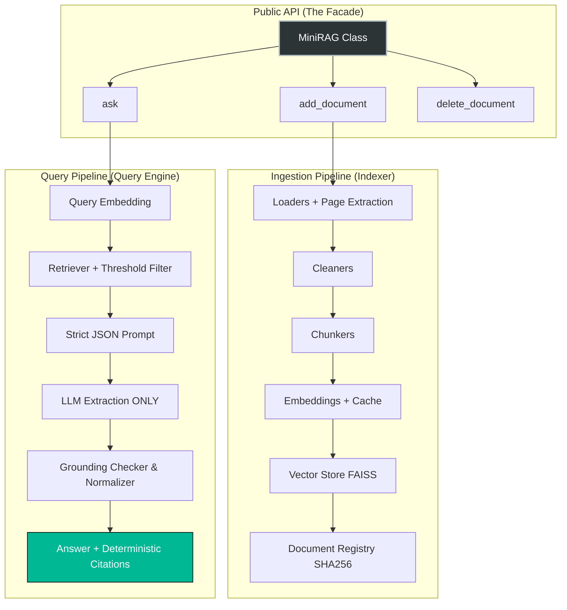

<div align="center">

# 🧠 MiniRAG

**A strictly Extractive, Zero-Hallucination RAG engine built from scratch.**
*Not a framework. Not a wrapper. Pure Python architecture.*

[](https://www.python.org/downloads/)
[](https://en.wikipedia.org/wiki/SOLID)
[]()
[](LICENSE)

</div>

---

## 🎯 What is MiniRAG?

MiniRAG is an educational, highly modular Retrieval-Augmented Generation (RAG) engine. It was designed to tear down the "magic" of libraries like LangChain or LlamaIndex and show exactly how a RAG pipeline works under the hood.

It is built to eventually serve as the **Knowledge Engine** for a larger AI assistant named Vylent, keeping a strict separation of concerns.

### What MiniRAG is NOT
- ❌ Another LangChain clone.
- ❌ A heavy framework with useless abstractions.
- ❌ A wrapper around existing APIs.

---

## 🧠 Philosophy: Generative vs. Extractive RAG (V1.1 Shift)

Most RAG systems are *Generative*: they fetch documents and ask an LLM to "summarize" or "explain" the answer. This often leads to "Hallucination-Lite" (the LLM changing words, adding unverified concepts, or losing the exact meaning).

**MiniRAG V1.1 is strictly Extractive.**
Instead of asking the LLM to write the answer, we treat the LLM as a dumb "JSON Extraction API". 
1. The LLM is only permitted to copy-paste exact sentences from the text into a JSON array.
2. A deterministic Python layer (The Grounding Checker) verifies if those exact words actually exist in the retrieved chunks.
3. If the LLM paraphrases, adds a single word, or hallucinates, the Python layer rejects the answer.

**Result:** 100% verifiable answers. If it's in the output, it is guaranteed to be in the document.

---

## 🏗️ Architecture Overview

MiniRAG follows strict **Interface-First Design** and **Dependency Injection**. Every component is a pluggable brick, completely separated from the Query orchestration logic.



---

## ⚡ Quick Start

### 1. Installation

```bash
git clone https://github.com/yourusername/MiniRAG.git
cd MiniRAG
pip install -r requirements.txt
```

### 2. Usage as a Library (The Vylent Way)

Vylent (or you) should never know about PDF parsing, chunking, or FAISS. You only interact with a 5-method API:

```python
from minirag import MiniRAG, Config

# Optional: Override defaults
config = Config(
    chunk_size=512,
    similarity_threshold=0.45, # V1.1 Feature
    primary_llm_provider="ollama"
)

# Initialize the engine
rag = MiniRAG(config=config)

# Index a document (handles deduplication via SHA256 automatically)
rag.add_document("D:/Books/philosophy.pdf")

# Ask a question (Returns structured Answer object)
answer = rag.ask("What is the soul?")

print(answer.text)
print(f"Confidence Level: {answer.confidence_level}")

# Debugging (V1.1 Feature)
if answer.confidence_level == "REJECTED":
    for rej in answer.trace.rejected_quotes:
        print(f"Blocked hallucination: {rej.reason}")
```

### 3. Interactive CLI

```bash
python -m minirag.cli
```

---

## 🧩 Pluggable Components

MiniRAG uses simple Factory patterns to swap implementations effortlessly via `Config`.

| Component | Interface | V1.1 Implementation | Future Options |
| :--- | :--- | :--- | :--- |
| **LLM** | `BaseLLM` | Ollama, Gemini (+ Fallback logic) | OpenAI, Claude, LM Studio |
| **Embeddings** | `BaseEmbedding` | BAAI/bge-m3 (+ Disk Cache Proxy) | OpenAI, Nomic, Jina |
| **Vector Store** | `BaseVectorStore` | FAISS (FlatL2 + UUID Mapping) | Qdrant, Milvus, Chroma |
| **Loaders** | `BaseLoader` | PDF (+Pages), TXT, Markdown, JSON | DOCX, HTML, PPTX |

### 🛡️ V1.1 Core Features
* **Zero-Hallucination Guarantee:** Grounding check ensures no LLM-generated text leaks into the final answer.
* **Persian NLP Resilient:** Built-in normalizer handles Arabic Diacritics (E'rab), Zero-Width Non-Joiners (ZWNJ), and character variations (`ی` vs `ي`).
* **Margin-Based Confidence:** Calculated mathematically based on Top-1 vs Top-2 retrieval scores, not guessed by the LLM.
* **Intelligent Fallback:** Ollama timeout -> Gemini API automatic routing.
* **Smart Embedding Cache:** Proxy pattern saves `.npy` files to skip heavy re-computation.

---

## 🗂️ Project Structure

```text
MiniRAG/
├── minirag/                    # The importable package
│   ├── facade.py               # The 5-method public API
│   ├── formatter.py            # V1.1: Grounding checker & Deterministic assembly
│   ├── config.py               # Immutable dataclass configuration
│   ├── engine/                 # Pipeline orchestration
│   ├── models/                 # Pure data structures (Answer, Trace, Citation)
│   ├── loaders/                # File parsing (Factory Pattern)
│   ├── embeddings/             # Vectorization + Cache Proxy
│   ├── vector_stores/          # Indexing & ID mapping
│   └── llms/                   # Generation + Fallback wrapper
├── data/                       # Runtime generated (Gitignored)
└── tests/                      # Unit & Integration tests
```

---

## 🔮 Roadmap

- [x] **V1.0:** Basic Generative RAG Pipeline, Fallback logic, Caching.
- [x] **V1.1:** Strict Extractive RAG, Grounding Check, Debug Trace, Persian Normalizer, Page extraction.
- [ ] **V1.2:** Hybrid Search (BM25 + Dense), Query Expansion.
- [ ] **V2.0:** Integration into Vylent Agent, REST API exposure.

---

## 🤝 Contributing

This is an educational project. If you want to add a new Loader (e.g., DOCX) or a new LLM provider:
1. Inherit from the `Base...` class.
2. Implement the required methods.
3. Add a mapping in the folder's `__init__.py` Factory.
*(Do not touch the `engine/` or `facade.py`!)*

---

## 📜 License

This project is licensed under the MIT License.

<div align="center">
    Built with 🖤 to prove RAG doesn't need to hallucinate.
</div>
