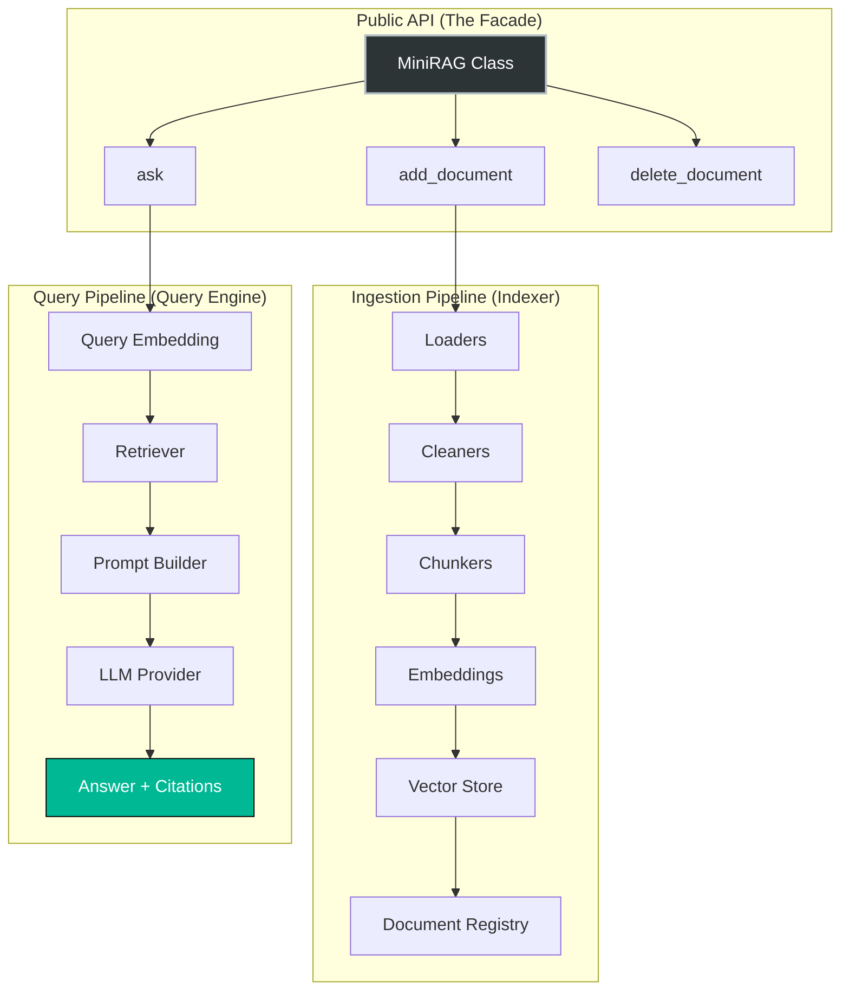

<div align="center">

# 🧠 MiniRAG

**A lightweight, library-first RAG engine built from scratch.**
*Not a framework. Not a wrapper. Pure Python architecture.*

[](https://www.python.org/downloads/)
[](https://en.wikipedia.org/wiki/SOLID)
[]()
[](LICENSE)

</div>

---

## 🎯 What is MiniRAG?

MiniRAG is an educational, highly modular Retrieval-Augmented Generation (RAG) engine. It was designed to tear down the "magic" of libraries like LangChain or LlamaIndex and show exactly how a RAG pipeline works under the hood.

It is built to eventually serve as the **Knowledge Engine** for a larger AI assistant named Vylent, keeping a strict separation of concerns.

### What MiniRAG is NOT
- ❌ Another LangChain clone.
- ❌ A heavy framework with useless abstractions.
- ❌ A wrapper around existing APIs.

---

## 🏗️ Architecture Overview

MiniRAG follows strict **Interface-First Design** and **Dependency Injection**. Every component (Loader, Embedder, LLM, VectorStore) is a pluggable brick.



### Core Design Principles
*   **Single Responsibility:** Every file does exactly one thing.
*   **Loose Coupling:** The `QueryEngine` doesn't know what `FAISS` is; it only knows `BaseVectorStore`.
*   **Open/Closed:** Add OpenAI or Milvus tomorrow without rewriting the core engine.

---

## ⚡ Quick Start

### 1. Installation

```bash
git clone https://github.com/yourusername/MiniRAG.git
cd MiniRAG
pip install -r requirements.txt
```

### 2. Usage as a Library (The Vylent Way)

Vylent (or you) should never know about PDF parsing, chunking, or FAISS. You only interact with a 5-method API:

```python
from minirag import MiniRAG, Config

# Optional: Customize configuration
config = Config(
    chunk_size=512,
    primary_llm_provider="gemini",
    gemini_api_key="your-api-key"
)

# Initialize the engine
rag = MiniRAG(config=config)

# Index a document (handles deduplication via SHA256 automatically)
rag.add_document("D:/Books/quantum_physics.pdf")

# Ask a question (Returns structured Answer object with citations)
answer = rag.ask("What is the uncertainty principle?")

print(answer.text)

for citation in answer.citations:
    print(f"Source: {citation.document_name} | Page: {citation.page}")
```

### 3. Interactive CLI

MiniRAG comes with a built-in terminal UI for testing and indexing.

```bash
python -m minirag.cli
```

---

## 🧩 Pluggable Components (V1.0)

MiniRAG uses simple Factory patterns to swap implementations effortlessly via `Config`.

| Component | Interface | V1.0 Implementation | Future Options |
| :--- | :--- | :--- | :--- |
| **LLM** | `BaseLLM` | Ollama, Gemini (+ Fallback logic) | OpenAI, Claude, LM Studio |
| **Embeddings** | `BaseEmbedding` | BAAI/bge-m3 (+ Disk Cache Proxy) | OpenAI, Nomic, Jina |
| **Vector Store** | `BaseVectorStore` | FAISS (FlatL2 + UUID Mapping) | Qdrant, Milvus, Chroma |
| **Loaders** | `BaseLoader` | PDF, TXT, Markdown, JSON | DOCX, HTML, PPTX |

### 🛡️ Intelligent Fallback System
If your local Ollama server times out, MiniRAG automatically catches the exception and routes the request to Gemini API, ensuring zero downtime in queries.

### 💾 Smart Caching Strategy
Embeddings are computationally expensive. MiniRAG implements a **Proxy Pattern** (`CachedEmbedding`) that saves `.npy` files to disk. If you rebuild your index or switch vector databases, MiniRAG skips the embedding model entirely and loads the vectors from cache.

---

## 🗂️ Project Structure

```text
MiniRAG/
├── minirag/                    # The importable package
│   ├── facade.py               # The 5-method public API
│   ├── config.py               # Immutable dataclass configuration
│   ├── engine/                 # Pipeline orchestration
│   │   ├── indexer.py          # Ingestion flow
│   │   └── query_engine.py     # Retrieval flow
│   ├── models/                 # Pure data structures (No I/O)
│   ├── loaders/                # File parsing
│   ├── embeddings/             # Vectorization + Cache Proxy
│   ├── vector_stores/          # Indexing & ID mapping
│   └── llms/                   # Generation + Fallback wrapper
├── data/                       # Runtime generated (Gitignored)
│   ├── chunks/                 # {doc_uuid}.json
│   ├── embeddings/             # Optional .npy cache
│   └── vector_db/              # FAISS index + ID map
└── tests/                      # Unit & Integration tests
```

---

## 🔮 Roadmap (V2+)

MiniRAG V1.0 is intentionally strict. No agents, no memory, no hybrid search. The architecture is designed so that adding these features will not break V1.

- [ ] **V1.1:** Retrieval Thresholding, Advanced Debug Traces, Structured Output Formatting.
- [ ] **V2.0:** Hybrid Search (Sparse + Dense), Query Rewriting, Reranking (Cross-Encoders).
- [ ] **V3.0:** Conversation Memory, Multi-modal RAG (Images), GraphRAG integration.
- [ ] **V4.0:** Plugin System, REST/gRPC API exposure for Vylent.

---

## 🤝 Contributing

This is an educational project. If you want to add a new Loader (e.g., DOCX) or a new LLM provider:
1. Create a new file in the respective folder (e.g., `minirag/loaders/docx_loader.py`).
2. Inherit from the `Base...` class.
3. Implement the required methods.
4. Add a mapping in the folder's `__init__.py` Factory.
*(Do not touch the `engine/` or `facade.py`!)*

---

## 📜 License

This project is licensed under the MIT License - see the [LICENSE](LICENSE) file for details.

<div align="center">
    Built with 🖤 for educational purposes.
</div>
